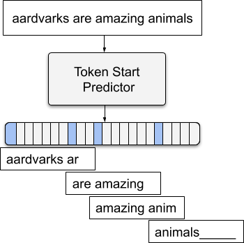
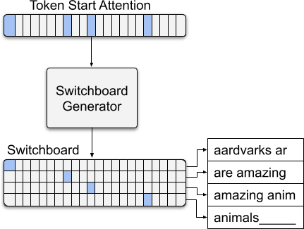
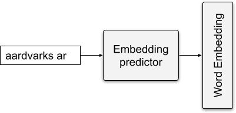
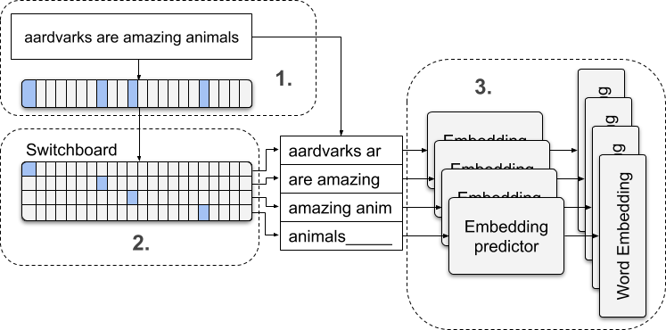
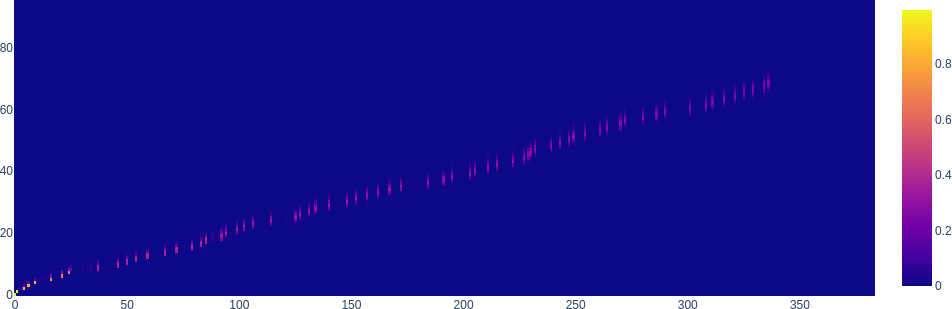
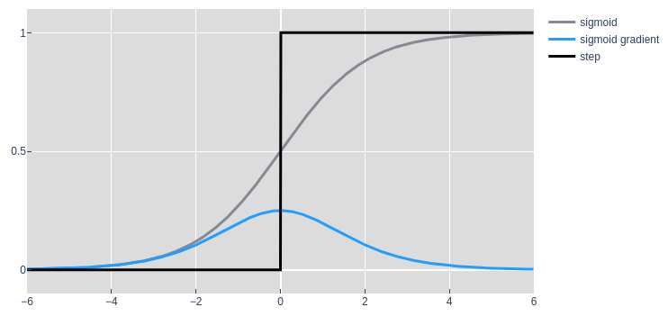

# Character level Language modelling

#### Note: Ongoing work. The experiments in this repo are designed to be run with my experiment framework [here](https://github.com/jtuckerk/experiment_framework).

### Principle goal of the experiments in this repo:

#### Train models to predict token embeddings from character encoded text. 
If we can **find meaningful chunks of characters** (words or tokens) 
and if from those characters we can **predict embeddings** for a pretrained language model, 
then we should be able to use those embeddings in the same ways they are used in any language task. My hope is that training such a model will be possible on "Free-Tier" quantities of compute. 

This work is motivated by many papers which find small amounts of success using large amounts of compute when trying to get character level language models to work well on anything other than next character prediction. I hope to leverage token-based pretrained models to reach state-of-the-art performance using characters as input. From there I hope to exceed token-level performance, by extending the effective vocabulary size, making models more robust to misspellings and uncommon words & names, and lastly increase performance of models for languages in which tokenization is much more difficult than in English.

## Overview
There are 3 things we'll need to do to predict a sequence of word embeddings from a sequence of characters.

1. Find the blocks of characters that make up words. In this case a block is a fixed length and only valid its first character is the first character of a word or word piece from the model vocab.
2. Isolate those blocks from the adjacent blocks that do not contain valid words.
3. Predict a word embeddings for each character block.

For the experiments in this repo I'll be using the [huggingface distilbert-base-uncased](https://huggingface.co/transformers/model_doc/distilbert.html) model and lowercase vocab/tokenizer. I'll be referring to 'word pieces' mostly just as 'words'

## 1. Predicting the first character of a word
This module has the job of predicting whether or not a character is the first character of a word.
We'll train this module on character encoded text with the objective of predicting whether or not the bert tokenizer would have split the sequence at each character. The [token_start_pred](token_start_pred) directory contains the model and experiment code for training this module.

  

## 2. Isolate the character blocks that start with words
This module takes in the attention vector from the previous module in order to construct a switchboard which will pass only valid word blocks to the next module. This mechanism works like the mechanisms in a [Neural Teuring Machine](https://arxiv.org/abs/1410.5401) for selecting memory addresses or the SortCut application of the [Sparse Sinkhorn Attention module](https://arxiv.org/abs/2002.11296): it uses matrix multiplication to select certain which rows from the input matrix to output as unchanged rows in a smaller matrix. Differentiable/Rule based state machines, LSTMs, and convolutional models all perform similarly average on this task. Experiments for this module on its own have not been included in this repo yet, but the switchboards can be inspected in the full model in [char_seq_to_emb_seq](char_seq_to_emb_seq).

  

## 3. Predicting words from characters
A word block must start with the first character of a word or word piece in order for it to be used by this module. 
Predicting a word's embedding from characters is fairly straightforward, but this module needs to be a bit more robust since a word block may contain more than just the first word of interest. Still, this can be done with a fairly small feed-forward network as shown in the [single_emb_pred](single_emb_pred) directory. At first glance this model code may not appear to be a simple FFNN becuase it uses convolution to operate on unfolded character blocks. However in these experiments only a single character block is used at a time. This is done so that the feed-forward network can efficiently be applied to a sequence of word blocks to calculate an embedding for each one. 

  

## Putting it all together: Steady progress

  

### Challenges posed by long sequences

  

The above shows the switchboard responsible for selecting which sequences of characters to pass to the embedding predictor module (3). As you can see the values start out close to 1 but slowly fade. This results in the character embeddings for multiple sequences of characters being combined via a weighted average. Given that the embedding prediction module (3) isn't trained to expect this sort of overlap this ends up leading to catastrophic failure of the model.

To overcome this I've used a step activation function to ensure that any character sequence passed through the switchboard is unperturbed. To make this differentiable I've used a sigmoid gradient. This seems to work fairly well.

  

One issue that arises with this set up is that module 1 does not have perfect accuracy. This can lead to cascading failures that can prevent the model from training given a standard MLM setup in which the expected output is distributions over each token in the sequence, including masked tokens. For example, if the first word is missed by module 1 the rest of the sequence will be offset by 1 and very little useful information will be gained from that step of training. To counter this I've changed the MLM task to predict token distribution of masked characters/tokens only. 

After retraining the distilbert model for 1 epoch to perform the mask-only MLM task, I'm seeing around 50% accuracy. Replacing the embedding lookup for the input and training for a few more epochs yields about 47% accuracy. It's still unclear what the best procedure is for training multiple pretrained components together. On the one hand, keeping the bert model frozen seems advisable since so much pretraining has gone into it. On the other hand, it has more expressive power than modules 1,2, and 3 and can likely help overcome any deficiencies they may have. Empirically, leaving Bert frozen for an epoch, and then unfreezing the whole model seems to perform best. But I have yet to do a full hyperparameter search to over multiple seeds to confirm this.

### Can such a model be trained end-to-end from scratch? Does the pretraining inductive bias of the submodules 1,2,3 and Bert hurt, not help?
I have not invested in the resources to test this conclusively, but from what I have seen it is not likely to outperform a model with pretrained subcomponents. I believe the switchboard imposes too tight of a bottleneck to let the word level information flow to the character->embedding prediction portion of the model. Digging in to figure out what sort of architectural or training changes would enable something with roughly this same set up is one direction I would like to take this work.
